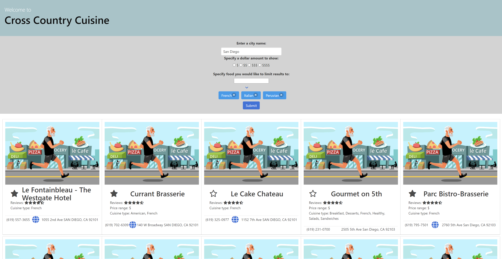

# Cross Country Cuisine

Find great restaurants all across the county with this interactive restaurant search engine. Sort results by location, type of food, and cost. Searches are easily entered via the user interface, and results are displayed with pictures and relevant information for each restaurant. Users can store search data and favorite results to create a running list of restaurant experiences. 
  
Feel free to refresh the page and come back whenever you need to check your search results, they'll stick around until you change or remove them.
 

## :memo: Features
 - Searchable interface that accepts location, cuisine and price filters
 - Easy to use and maintain and easy to pick up
 - Lightweight and fast - no bulky code or unnecessary additions here!
 - Full support for saving favorites:
    - All favorite restaurants are saved to the respected city
    - They are loaded on website start and also when the city is searched, making it easy to find what you want
- Website (if included), phone number, and address included per restaurant

## :construction: List of TO-DO's for future release/collaboration
This, in its current state is a MVP. A list of potential features is listed below.
 - Add settings to page to provide photos specific to the search result
 - Expand available search filters
 - Incorporate reviews and local area map
 - Add links to activities in the local area upon returning search results
 - Incorporate 3rd party app to make reservations via the website
 - Add in a carousel of pictures from each restaurant, to increase user engagement
 - Add in API to display reviews and missing information
 - Limit each type of cuisine (if multiple are selected), so user sees a good combo, instead of predominately one
 
## :key: How to access
The code base can be cloned from the GitHub repo [here](https://github.com/dai2119555/CrossCountryCusine).
 
The website may be viewed on GitPages [here](https://dai2119555.github.io/CrossCountryCusine/)
 
## :trophy: Credit
Full Javascript and functionality by Matt and Aaron
Initial CSS and HTML by Kevin and Dailen
 

 
 
Project is fully open source: explore the code and upgrade away!
 
 

